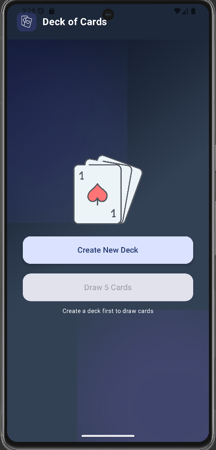

<div align="center">

#  Proyecto Android - Baraja de Cartas 

**Aplicación desarrollada en Kotlin + Jetpack Compose**  
Integrando la API pública [Deck of Cards API](https://deckofcardsapi.com)

</div>

---

##  Descripción

Esta app Android demuestra el consumo de una API REST en tiempo real utilizando **Retrofit** y **StateFlow** con arquitectura limpia.

---

##  Capturas de Pantalla

<div align="center">
  
  
</div>

---

##  Arquitectura

```
UI (Compose)
   ↓
ViewModel (DeckViewModel)
   ↓
Repository (DeckRepository)
   ↓
Retrofit → Deck of Cards API
```

---

##  Dependencias

| Tipo | Librería | Descripción |
|------|----------|-------------|
|  Arquitectura | `androidx.lifecycle.viewmodel.ktx` | Soporte ViewModel con Kotlin coroutines |
|  Networking | `retrofit2, okhttp3, gson` | API REST |
|  UI | `androidx.compose.material3, coil-compose` | Interfaz moderna y carga de imágenes |
|  Test | `strikt, kotlinx-coroutines-test` | Pruebas unitarias declarativas |

---

##  Equipo de Desarrollo

<table>
  <tr>
    <th>Foto</th>
    <th>Nombre</th>
    <th>Código</th>
    <th>Rol</th>
  </tr>
  <tr>
    <td></td>
    <td>Mariana Osorio</td>
    <td><code>MO-001</code></td>
    <td> UI / Compose</td>
  </tr>
  <tr>
    <td></td>
    <td>David Mantilla</td>
    <td><code>DM-002</code></td>
    <td> Arquitectura / ViewModel / Tests</td>
  </tr>
  <tr>
    <td></td>
    <td>Jhovanny Quiceno</td>
    <td><code>JQ-003</code></td>
    <td> Networking / Retrofit</td>
  </tr>
</table>

---

##  Requisitos

- Android Studio Iguana o superior
- Kotlin 1.9+
- Gradle 8+
- Compose habilitado
- Permiso de internet

---

##  Ejemplo de Test

```kotlin
@Test
fun `viewModel initializes with default empty state`() {
    val vm = DeckViewModel()
    expectThat(vm.deckState.value).isNull()
    expectThat(vm.cardsState.value).isEmpty()
}
```

---

<div align="center">

 **Proyecto académico - Universidad EAM © 2025**

</div>
